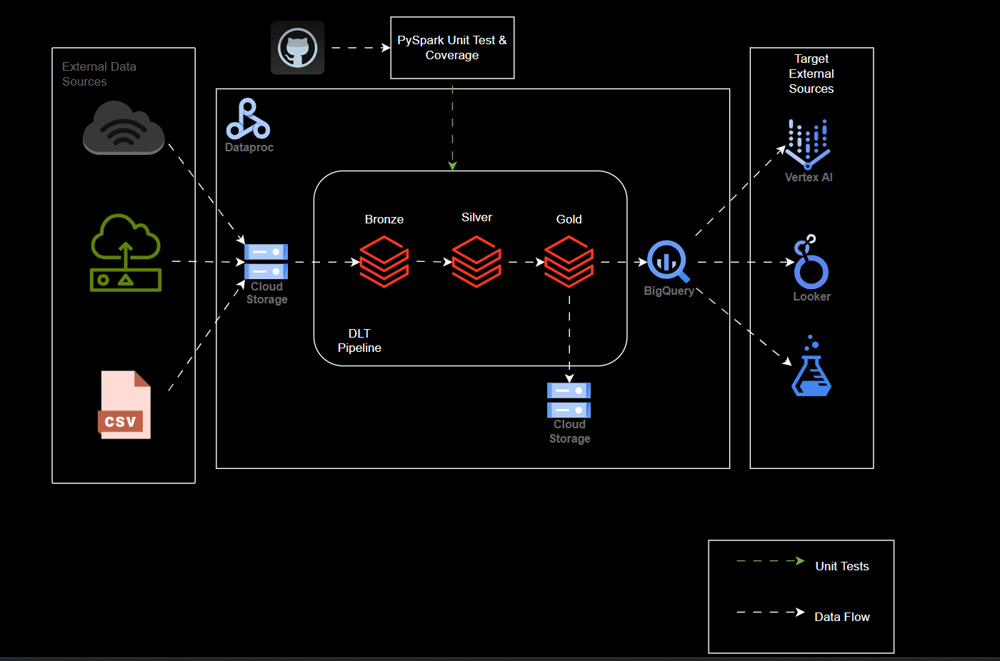
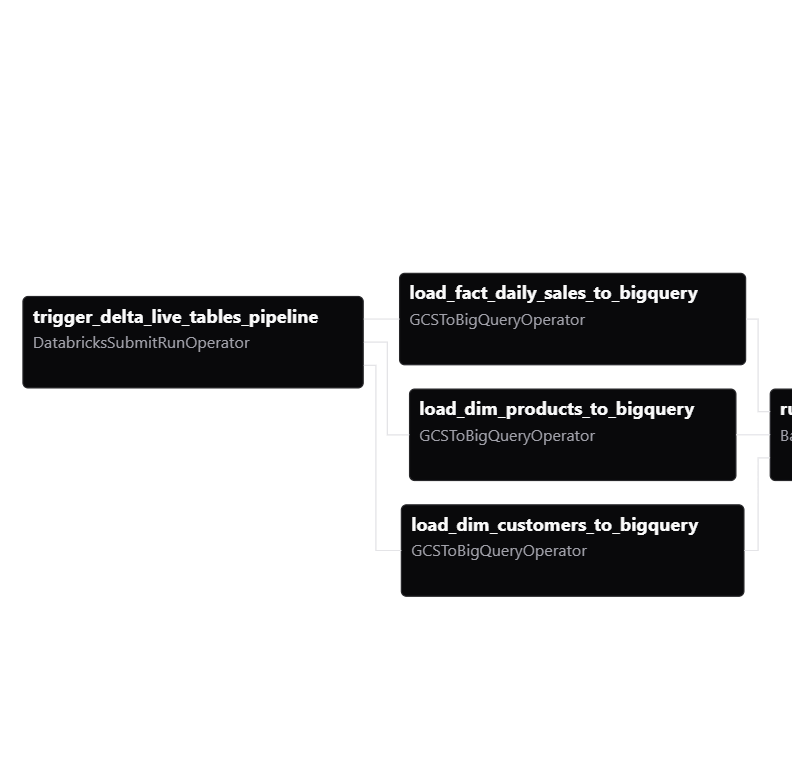

<body>
    

        <h1 id="e-commerce-data-analytics-pipeline-local-development-guide" class="text-3xl pb-2 border-b-2 border-gray-200">E-commerce Data Analytics Pipeline (Local Development Guide)</h1>
        <h2 id="table-of-contents" class="text-2xl mt-8 pb-1 border-b border-gray-200">Table of Contents</h2>
        <ul>
            <li><a href="#1-overview" class="text-blue-500 hover:underline">1. Overview</a></li>
            <li><a href="#2-features" class="text-blue-500 hover:underline">2. Features</a></li>
            <li><a href="#3-architecture" class="text-blue-500 hover:underline">3. Architecture</a></li>
            <li><a href="#4-getting-started-local-development" class="text-blue-500 hover:underline">4. Getting Started (Local Development)</a>
                <ul>
                    <li><a href="#prerequisites" class="text-blue-500 hover:underline">Prerequisites</a></li>
                    <li><a href="#project-structure" class="text-blue-500 hover:underline">Project Structure</a></li>
                    <li><a href="#setup-steps" class="text-blue-500 hover:underline">Setup Steps</a></li>
                </ul>
            </li>
            <li><a href="#5-key-technologies" class="text-blue-500 hover:underline">5. Key Technologies</a></li>
            <li><a href="#6-deployment-to-production" class="text-blue-500 hover:underline">6. Deployment to Production</a></li>
            <li><a href="#7-contributing" class="text-blue-500 hover:underline">7. Contributing</a></li>
            <li><a href="#8-license" class="text-blue-500 hover:underline">8. License</a></li>
        </ul>
        

        <h2 id="1-overview" class="text-2xl mt-8 pb-1 border-b border-gray-200">1. Overview</h2>
        
This project provides an end-to-end data analytics pipeline for e-commerce data, demonstrating modern data engineering practices using Databricks Delta Live Tables (DLT), Apache Spark, Google Cloud Storage (GCS), BigQuery, and Apache Airflow for orchestration. The pipeline processes raw data, applies transformations including Change Data Capture (CDC) / Slowly Changing Dimension (SCD) Type 2 logic, and loads analytics-ready data into a BigQuery data warehouse.

        <h2 id="2-features" class="text-2xl mt-8 pb-1 border-b border-gray-200">2. Features</h2>
        <ul>
            <li><strong>Automated Data Ingestion:</strong> Incremental loading of raw CSV data from GCS using Databricks Auto Loader.</li>
            <li><strong>Multi-Layered Architecture (Medallion):</strong> Data processing through Bronze, Silver, and Analytic (Gold) layers using Delta Lake tables.</li>
            <li><strong>Advanced Transformations:</strong> Spark-based transformations including:
                <ul>
                    <li><strong>SCD Type 2:</strong> Maintains historical versions of dimension data (products, customers).</li>
                    <li><strong>Fact Data Processing:</strong> Prepares sales data for efficient analytical querying.</li>
                </ul>
            </li>
            <li><strong>GCS Staging:</strong> Dumps transformed data into GCS as partitioned Parquet files for optimized BigQuery ingestion.</li>
            <li><strong>Direct BigQuery Loading:</strong> Efficiently loads Parquet data from GCS directly into BigQuery using GCP's native capabilities.</li>
            <li><strong>Robust Orchestration:</strong> Apache Airflow manages the entire workflow, from triggering Databricks jobs to loading data into BigQuery.</li>
            <li><strong>Reproducible Environment:</strong> Uses Docker Compose for local development.</li>
        </ul>
        <h2 id="3-architecture" class="text-2xl mt-8 pb-1 border-b border-gray-200">3. Architecture</h2>
        
The pipeline follows a layered architecture to ensure data quality, consistency, and reusability.

        
        <pre class="diagram"><code>+-------------+       +-------------------+       +-----------------------+       +-----------------------+
|             |       | Databricks DLT    |       | Spark Job (Databricks)|       |                       |
| Raw Data    |-----> | (Bronze & Silver) |-----> | (Analytic Layer)      |-----> | GCS Analytic Layer    |
| (GCS Bucket)|       | (Delta Lake)      |       | (CDC/SCD Type 2)      |       | (Partitioned Parquet) |
+-------------+       +-------------------+       +-----------------------+       +-----------------------+
        ^                                                  |                                  |
        |                                                  |                                  |
        |                                                  V                                  V
        |                                        +---------------------+          +-----------------------------------+
        |                                        | Apache Airflow      |--------> | BigQuery Data Warehouse           |
        |                                        | (Orchestration)     |          | (fact_sales, dim_prod, dim_cust)  |
        |                                        |                     |          |           ^                       |
        |                                        +---------------------+          |           |                       |
        |                                                  |                      |      (dbt models/tests)           |
        |                                                  V                      |           V                       |
        |                                           (Triggers Jobs)               +-----------------------------------+
        +---------------------------------------------------------------------------------------------------------------------------------+
</code></pre>
        <h2 id="4-getting-started-local-development" class="text-2xl mt-8 pb-1 border-b border-gray-200">4. Getting Started (Local Development)</h2>
        
This section guides you through setting up the project locally using Docker Compose for Airflow and interacting with Databricks and GCP.

        <h3 id="prerequisites" class="text-xl mt-6">Prerequisites</h3>
        <ul>
            <li><strong>Docker Desktop:</strong> (Recommended) Installed and running on your machine (Windows, macOS, or Linux).</li>
            <li><strong>Git:</strong> For cloning the repository.</li>
            <li><strong>Python 3.x:</strong> Installed on your host for running <code>generate_data.py</code>.</li>
            <li><strong>Google Cloud Platform (GCP) Project:</strong>
                <ul>
                    <li>Ensure billing is enabled.</li>
                    <li>Create <strong>three GCS buckets</strong>:
                        <ul>
                            <li><code>gs://your-project-id-raw-data</code> (for raw CSVs)</li>
                            <li><code>gs://your-project-id-processed-data</code> (for DLT internal storage)</li>
                            <li><code>gs://your-project-id-analytic-layer</code> (for final Parquet output)</li>
                        </ul>
                    </li>
                    <li>Enable APIs: <code>IAM API</code>, <code>Security Token Service API</code>, <code>Service Account Credentials API</code>, <code>BigQuery API</code>, <code>Cloud Storage API</code>.</li>
                    <li>Create a <strong>GCP Service Account</strong> with roles:
                        <ul>
                            <li><code>Storage Object Admin</code> (for all GCS buckets)</li>
                            <li><code>BigQuery Data Editor</code> (for your BigQuery dataset)</li>
                            <li><code>BigQuery Job User</code></li>
                        </ul>
                    </li>
                    <li>Generate a JSON key file for this service account (<code>gcp_sa_key.json</code>).</li>
                </ul>
            </li>
            <li><strong>Databricks Workspace (on GCP):</strong>
                <ul>
                    <li>Ensure it's active and you have administrator access.</li>
                    <li>Configure <strong>Workload Identity Federation</strong> between Databricks and your GCP project/service account. (Refer to Databricks official documentation for this crucial step).</li>
                    <li>Generate a <strong>Databricks Personal Access Token (PAT)</strong> for Airflow to authenticate to the Databricks API.</li>
                </ul>
            </li>
        </ul>
        <h3 id="project-structure" class="text-xl mt-6">Project Structure</h3>
        <pre><code>your-ecom-data-pipeline/
├── dags/                          # Airflow DAGs
│   └── ecom_pipeline_final_dag.py
├── spark_scripts/                 # Databricks Spark scripts
│   └── 03_analytic_layer_transformations.py
├── dbt_project/                   # Your dbt project (models, profiles.yml etc.)
│   ├── models/
│   └── profiles.yml
├── dlt_pipelines/                 # Databricks DLT Python notebooks
│   └── ecom_dlt_pipeline.py
├── gcp_keys/                      # Store your GCP Service Account JSON key here
│   └── gcp_sa_key.json
├── airflow_env/                   # Docker Compose setup for Airflow
│   ├── .env                       # Environment variables for Docker Compose
│   ├── docker-compose.yaml        # Main Airflow Docker Compose configuration
│   ├── requirements.txt           # Python dependencies for Airflow containers
│   └── Dockerfile                 # Custom Dockerfile to extend Airflow image
├── raw_data/                      # Local directory for generated raw CSVs
└── generate_data.py               # Script to generate synthetic raw data
</code></pre>
        <h3 id="setup-steps" class="text-xl mt-6">Setup Steps</h3>
        <ol>
            <li><strong>Clone the Repository / Create Project Structure:</strong>
                <pre><code>git clone &lt;your-repo-url&gt; # Or manually create the folder structure above
cd your-ecom-data-pipeline
</code></pre>
                
Create empty <code>dags</code>, <code>spark_scripts</code>, <code>dbt_project</code>, <code>dlt_pipelines</code>, <code>gcp_keys</code>, <code>raw_data</code>, <code>airflow_env</code> directories.

            </li>
            <li><strong>Generate Raw Data:</strong>
                
Run the data generation script. This will create CSV files in the <code>raw_data/</code> directory.

                <pre><code>python generate_data.py
</code></pre>
            </li>
            <li><strong>Upload Raw Data to GCS:</strong>
                
Upload the contents of your local <code>raw_data/</code> directory to your GCS raw data bucket (<code>gs://your-project-id-raw-data/</code>).

                <pre><code>gsutil cp -r raw_data/* gs://your-project-id-raw-data/
</code></pre>
            </li>
            <li><strong>Set up Airflow Docker Compose:</strong>
                <ul>
                    <li><strong>Navigate to <code>airflow_env/</code>:</strong>
                        <pre><code>cd your-ecom-data-pipeline/airflow_env
</code></pre>
                    </li>
                    <li><strong>Download <code>docker-compose.yaml</code>:</strong>
                        <pre><code>curl -LfO "https://airflow.apache.org/docs/apache-airflow/2.9.0/docker-compose.yaml"
</code></pre>
                        
<em>(Adjust Airflow version if needed)</em>

                    </li>
                    <li><strong>Create <code>.env</code> file:</strong>
                        <pre><code>touch .env</code></pre>
                        
Add the following content. <strong>For <code>AIRFLOW_UID</code>, run <code>id -u</code> on Linux/macOS to get your user ID. On Windows (WSL2), <code>0</code> often works best.</strong>

                        <pre><code># .env file inside your-ecom-data-pipeline/airflow_env/
                            AIRFLOW_UID=50000
                            _AIRFLOW_WWW_USER_USERNAME=airflow
                            _AIRFLOW_WWW_USER_PASSWORD=airflow
                            AIRFLOW_IMAGE_NAME=apache/airflow:2.9.0-python3.9
                            This points to the parent directory of 'airflow_env/', which is 'your-ecom-data-pipeline/'
                            AIRFLOW_PROJ_DIR=..
                        </code></pre>
                    </li>
                    <li><strong>Create <code>requirements.txt</code>:</strong>
                        <pre><code>touch requirements.txt</code></pre>
                        
Add the necessary Airflow providers and other Python libraries:

                        <pre><code># requirements.txt inside your-ecom-data-pipeline/airflow_env/
                            apache-airflow-providers-google
                            apache-airflow-providers-databricks
                            dbt-bigquery # If you plan to run dbt directly on the Airflow worker
                        </code></pre>
                    </li>
                    <li><strong>Create <code>Dockerfile</code>:</strong>
                        <pre><code>touch Dockerfile</code></pre>
                        
Add the following content to customize your Airflow image:

                        <pre><code># your-ecom-data-pipeline/airflow_env/Dockerfile
                            FROM apache/airflow:2.9.0-python3.9 # Match your AIRFLOW_IMAGE_NAME from .env                            
                            USER root                            
                            Install any necessary system-level dependencies (e.g., git if dbt pulls from Git)
                            For a minimal setup, you might not need additional system packages.
                            RUN apt-get update && \
                            apt-get install -y --no-install-recommends \
                            git \
                            && apt-get clean && rm -rf /var/lib/apt/lists/*
                            COPY requirements.txt /requirements.txt
                            RUN pip install --no-cache-dir -r /requirements.txt                            
                            USER airflow
                        </code></pre>
                    </li>
                    <li><strong>Modify <code>docker-compose.yaml</code>:</strong> Open the <code>docker-compose.yaml</code> file in <code>airflow_env/</code>.
                        <ul>
                            <li>Find the <code>image:</code> lines for <code>airflow-worker</code>, <code>airflow-scheduler</code>, <code>airflow-webserver</code> (and <code>airflow-init</code> if present).</li>
                            <li><strong>Replace <code>image:</code> with <code>build: .</code></strong> to tell Docker Compose to build your custom image.</li>
                            <li><strong>Add/Verify Volume Mounts:</strong> Ensure the <code>volumes</code> section under <code>x-airflow-common</code> looks like this:
                                <pre><code>x-airflow-common:
  &amp;airflow-common
  volumes:
    - ${AIRFLOW_PROJ_DIR:-.}/dags:/opt/airflow/dags
    - ${AIRFLOW_PROJ_DIR:-.}/logs:/opt/airflow/logs
    - ${AIRFLOW_PROJ_DIR:-.}/config:/opt/airflow/config
    - ${AIRFLOW_PROJ_DIR:-.}/plugins:/opt/airflow/plugins
    - ${AIRFLOW_PROJ_DIR:-.}/spark_scripts:/opt/airflow/spark_scripts
    - ${AIRFLOW_PROJ_DIR:-.}/dbt_project:/opt/airflow/dbt_project # Ensure folder name is 'dbt_project' on host
    - ${AIRFLOW_PROJ_DIR:-.}/gcp_keys:/opt/airflow/artifacts/credentials # Maps host gcp_keys to container path
</code></pre>
                            </li>
                        </ul>
                    </li>
                    <li><strong>Place <code>gcp_sa_key.json</code>:</strong> Copy your GCP service account JSON key file into <code>your-ecom-data-pipeline/gcp_keys/</code> and name it <code>gcp_sa_key.json</code>.</li>
                </ul>
            </li>
            <li><strong>Initialize Airflow Database & Start Services:</strong>
                
From inside <code>your-ecom-data-pipeline/airflow_env/</code>:

                <pre><code>docker compose down # Ensure no old containers are running
docker compose build # Build your custom Airflow image
docker compose up airflow-init # Initialize Airflow DB
docker compose up -d # Start Airflow services in detached mode
</code></pre>
            </li>
            <li><strong>Upload Databricks Scripts:</strong>
                
Upload <code>dlt_pipelines/ecom_dlt_pipeline.py</code> and <code>spark_scripts/03_analytic_layer_transformations.py</code> to your Databricks workspace (e.g., to <code>dbfs:/FileStore/spark_scripts/</code>).

            </li>
            <li><strong>Create DLT Pipeline in Databricks UI:</strong>
                <ul>
                    <li>Go to <strong>Databricks UI &gt; Workflows &gt; Delta Live Tables &gt; Create Pipeline</strong>.</li>
                    <li><strong>Pipeline name:</strong> <code>ecom_dlt_pipeline_airflow</code></li>
                    <li><strong>Notebook libraries:</strong> Point to your uploaded <code>ecom_dlt_pipeline.py</code>.</li>
                    <li><strong>Target schema:</strong> <code>ecom_dlt_db</code> (or a Unity Catalog schema).</li>
                    <li><strong>Storage location:</strong> Set this to your GCS DLT storage bucket, e.g., <code>gs://your-project-id-processed-data/dlt_storage</code>.</li>
                    <li><strong>Pipeline mode:</strong> <code>Triggered</code>.</li>
                    <li><strong>NOTE DOWN THE PIPELINE ID</strong> from the URL after creation.</li>
                </ul>
            </li>
            <li><strong>Configure Airflow UI Connections:</strong>
                <ul>
                    <li>Access Airflow UI: <a href="http://localhost:8080" class="text-blue-500 hover:underline">http://localhost:8080</a> (default user/pass: <code>airflow</code>/<code>airflow</code>).</li>
                    <li>Go to <strong>Admin &gt; Connections</strong>.</li>
                    <li><strong>Edit <code>databricks_default</code>:</strong>
                        <ul>
                            <li><strong>Conn Id:</strong> <code>databricks_default</code></li>
                            <li><strong>Conn Type:</strong> <code>Databricks</code></li>
                            <li><strong>Host:</strong> Your Databricks Workspace URL (e.g., <code>https://dbc-xxxxxxxx.cloud.databricks.com/</code>).</li>
                            <li><strong>Password:</strong> Your Databricks Personal Access Token (PAT).</li>
                            <li><strong>Test &amp; Save.</strong></li>
                        </ul>
                    </li>
                    <li><strong>Ensure <code>google_cloud_default</code> is configured:</strong> This is often pre-configured, but if not, create/edit it:
                        <ul>
                            <li><strong>Conn Id:</strong> <code>google_cloud_default</code></li>
                            <li><strong>Conn Type:</strong> <code>Google Cloud</code></li>
                            <li><strong>Keyfile Path / JSON:</strong> For local Docker, you can put the <em>container path</em> to your service account key, e.g., <code>/opt/airflow/artifacts/credentials/gcp_sa_key.json</code>. Set <code>Use JSON Keyfile</code> to <code>True</code>.</li>
                            <li><strong>Test &amp; Save.</strong></li>
                        </ul>
                    </li>
                </ul>
            </li>
            <li><strong>Update Airflow DAG Configuration:</strong>
                
Open <code>your-ecom-data-pipeline/dags/ecom_pipeline_final_dag.py</code> and replace all placeholder values:

                <ul>
                    <li><code>DATABRICKS_CLUSTER_ID</code>: Your Databricks cluster ID for the analytic layer job (or leave as comment if using new ephemeral clusters managed by Databricks job run).</li>
                    <li><code>DATABRICKS_DLT_PIPELINE_ID</code>: The ID you noted in step 7.</li>
                    <li><code>GCP_PROJECT_ID</code>: Your GCP project ID.</li>
                    <li><code>BQ_DATASET</code>: Your BigQuery dataset name (e.g., <code>ecom_dwh</code>).</li>
                    <li><code>DLT_STORAGE_GCS_PATH</code>: Your DLT storage bucket path (e.g., <code>gs://your-project-id-processed-data/dlt_storage</code>).</li>
                    <li><code>ANALYTIC_LAYER_GCS_PATH</code>: Your Analytic Layer GCS bucket path (e.g., <code>gs://your-project-id-analytic-layer</code>).</li>
                    <li><code>DBFS_ANALYTIC_TRANSFORM_SCRIPT_PATH</code>: The DBFS path where you uploaded <code>03_analytic_layer_transformations.py</code>.</li>
                    <li><code>DBT_PROJECT_PATH</code>: The container path to your dbt project, matching your volume mount (e.g., <code>/opt/airflow/dbt_project</code>).</li>
                    <li><code>GCP_SA_KEY_PATH_FOR_DBT</code>: The container path to your GCP SA key (<code>/opt/airflow/artifacts/credentials/gcp_sa_key.json</code>).</li>
                </ul>
            </li>
            <li><strong>Run the DAG:</strong>
                <ul>
                    <li>In the Airflow UI, find <code>ecom_data_pipeline_final</code>.</li>
                    <li><strong>Unpause</strong> it.</li>
                    <li>Click the <strong>"Trigger DAG"</strong> (play icon) button.</li>
                    <li>Monitor the progress in the Graph View and task logs.</li>
                </ul>
            </li>
        </ol>

        <h2 id="5-key-technologies" class="text-2xl mt-8 pb-1 border-b border-gray-200">5. Key Technologies</h2>
        <ul>
            <li><strong>Apache Airflow:</strong> Workflow orchestration.</li>
            <li><strong>Databricks:</strong> Unified analytics platform.</li>
            <li><strong>Delta Live Tables (DLT):</strong> Declarative ETL pipelines.</li>
            <li><strong>Apache Spark:</strong> Distributed data processing.</li>
            <li><strong>Delta Lake:</strong> Open-source storage layer.</li>
            <li><strong>Google Cloud Storage (GCS):</strong> Object storage.</li>
            <li><strong>Google BigQuery:</strong> Serverless data warehouse.</li>
            <li><strong>dbt (Data Build Tool):</strong> Data transformation framework.</li>
            <li><strong>Docker / Docker Compose:</strong> Containerization for local development.</li>
        </ul>
        <h2 id="6-deployment-to-production" class="text-2xl mt-8 pb-1 border-b border-gray-200">6. Deployment to Production</h2>
        
For production environments on GCP, it is highly recommended to use <strong>Google Cloud Composer</strong>. Composer is a fully managed Airflow service that simplifies deployment, scaling, and maintenance, and provides seamless integration with other GCP services.

        <h2 id="7-contributing" class="text-2xl mt-8 pb-1 border-b border-gray-200">7. Contributing</h2>
        
Feel free to contribute to this project by opening issues or submitting pull requests.

        <h2 id="8-license" class="text-2xl mt-8 pb-1 border-b border-gray-200">8. License</h2>
        
This project is licensed under the MIT License - see the <code>LICENSE</code> file for details.

</body>
